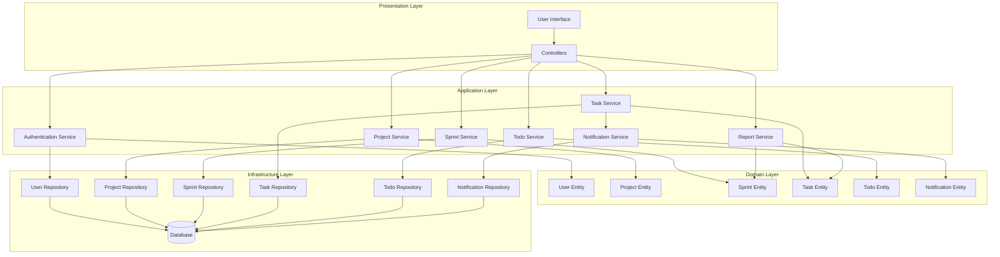
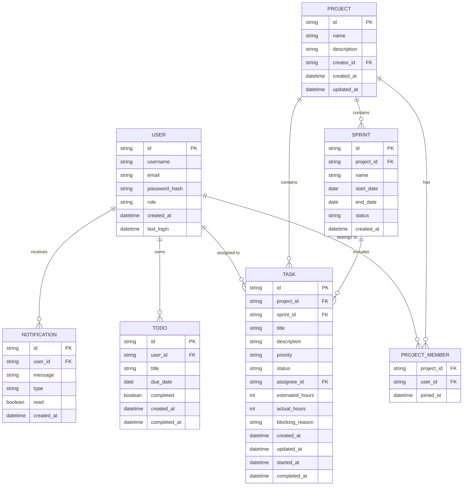
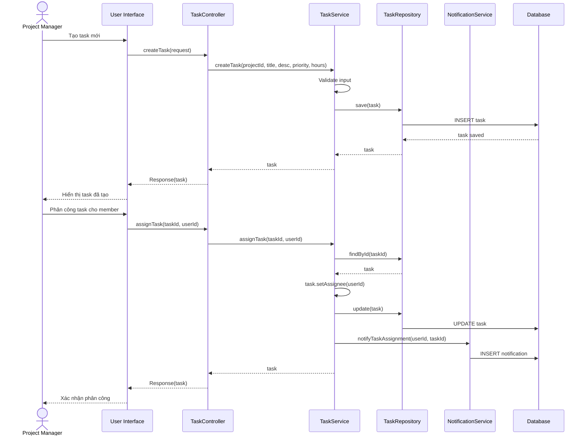
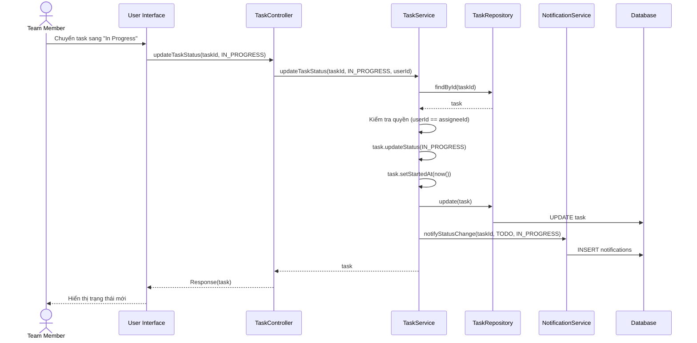
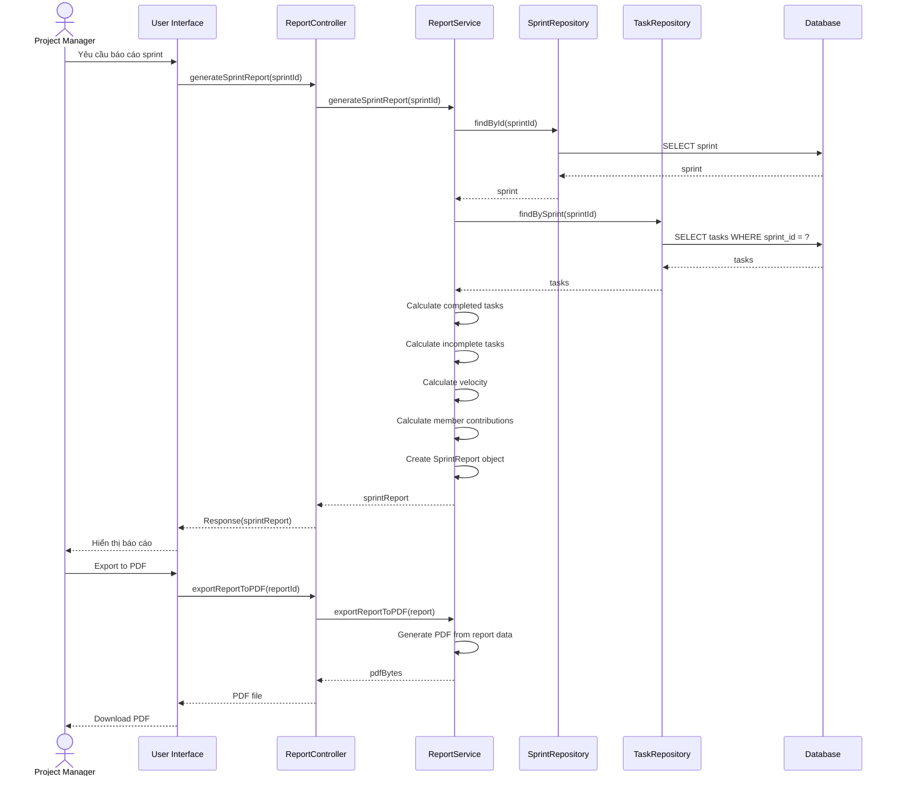
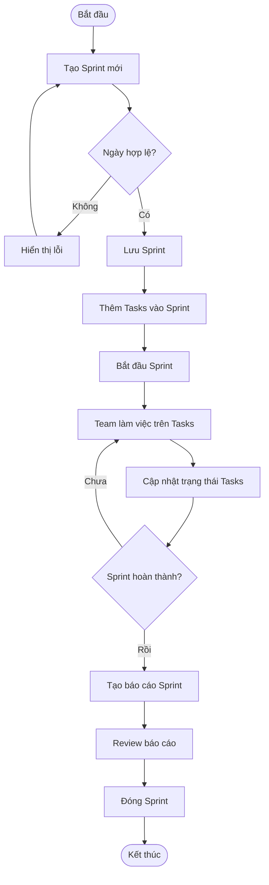
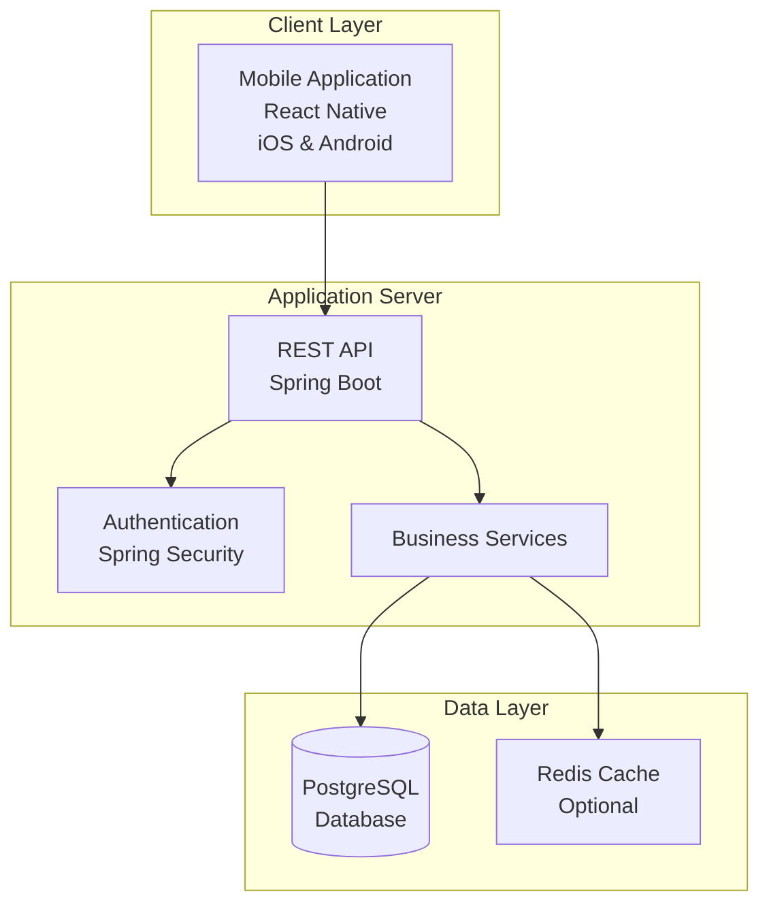

# Design Document - Task & Project Management Tool

## Overview

Task & Project Management Tool là một ứng dụng desktop/web được xây dựng theo kiến trúc phân lớp (Layered Architecture) với mô hình MVC (Model-View-Controller). Hệ thống sử dụng các design patterns phổ biến trong OOP như Repository Pattern, Service Layer Pattern, Factory Pattern, và Observer Pattern để đảm bảo tính mở rộng, bảo trì và tuân thủ các nguyên tắc SOLID.

Hệ thống được thiết kế để hỗ trợ các nhóm phát triển phần mềm áp dụng phương pháp Agile/Scrum, cung cấp các tính năng quản lý dự án, sprint, task, và báo cáo tiến độ một cách trực quan và hiệu quả.

## Architecture

### Kiến trúc tổng thể

Hệ thống áp dụng kiến trúc phân lớp 4 tầng:

```
┌─────────────────────────────────────────┐
│     Presentation Layer (UI/View)       │
│  - Desktop GUI / Web Interface          │
│  - Controllers                          │
└─────────────────────────────────────────┘
                  ↓
┌─────────────────────────────────────────┐
│      Application Layer (Services)      │
│  - Business Logic Services              │
│  - Use Case Implementations             │
└─────────────────────────────────────────┘
                  ↓
┌─────────────────────────────────────────┐
│       Domain Layer (Models)             │
│  - Domain Entities                      │
│  - Business Rules                       │
└─────────────────────────────────────────┘
                  ↓
┌─────────────────────────────────────────┐
│   Infrastructure Layer (Data Access)    │
│  - Repositories                         │
│  - Database Access                      │
│  - External Services                    │
└─────────────────────────────────────────┘
```

### Mô hình kiến trúc Mermaid



### Design Patterns được áp dụng

1. **Repository Pattern**: Tách biệt logic truy cập dữ liệu khỏi business logic
2. **Service Layer Pattern**: Đóng gói business logic và use cases
3. **Factory Pattern**: Tạo các đối tượng phức tạp (Report Factory)
4. **Observer Pattern**: Thông báo khi có thay đổi trạng thái (Notification System)
5. **Singleton Pattern**: Quản lý kết nối database
6. **Strategy Pattern**: Xử lý các thuật toán tính toán khác nhau (velocity, burndown)
7. **Dependency Injection**: Giảm coupling giữa các components

## Components and Interfaces

### 1. Presentation Layer

#### Controllers

**AuthenticationController**
```java
public class AuthenticationController {
    private AuthenticationService authService;
    
    public Response register(RegisterRequest request);
    public Response login(LoginRequest request);
    public Response logout(String sessionToken);
    public Response requestPasswordReset(String email);
}
```

**ProjectController**
```java
public class ProjectController {
    private ProjectService projectService;
    
    public Response createProject(CreateProjectRequest request);
    public Response getProjects(String userId);
    public Response updateProject(String projectId, UpdateProjectRequest request);
    public Response deleteProject(String projectId);
    public Response addMember(String projectId, String userId);
}
```

**SprintController**
```java
public class SprintController {
    private SprintService sprintService;
    
    public Response createSprint(CreateSprintRequest request);
    public Response getSprints(String projectId);
    public Response updateSprint(String sprintId, UpdateSprintRequest request);
    public Response deleteSprint(String sprintId);
    public Response getSprintProgress(String sprintId);
}
```

**TaskController**
```java
public class TaskController {
    private TaskService taskService;
    
    public Response createTask(CreateTaskRequest request);
    public Response assignTask(String taskId, String userId);
    public Response updateTaskStatus(String taskId, TaskStatus status);
    public Response updateTask(String taskId, UpdateTaskRequest request);
    public Response deleteTask(String taskId);
    public Response searchTasks(SearchCriteria criteria);
}
```

### 2. Application Layer (Services)

**AuthenticationService**
```java
public interface AuthenticationService {
    User register(String username, String email, String password) throws ValidationException;
    Session login(String email, String password) throws AuthenticationException;
    void logout(String sessionToken);
    void requestPasswordReset(String email);
    String hashPassword(String password);
    boolean verifyPassword(String password, String hashedPassword);
}
```

**ProjectService**
```java
public interface ProjectService {
    Project createProject(String name, String description, String creatorId) throws ValidationException;
    List<Project> getProjectsByUser(String userId);
    Project updateProject(String projectId, String name, String description) throws NotFoundException;
    void deleteProject(String projectId) throws NotFoundException;
    void addMember(String projectId, String userId) throws NotFoundException;
    boolean hasAccess(String userId, String projectId);
}
```

**SprintService**
```java
public interface SprintService {
    Sprint createSprint(String projectId, String name, LocalDate startDate, LocalDate endDate) 
        throws ValidationException;
    List<Sprint> getSprintsByProject(String projectId);
    Sprint updateSprint(String sprintId, String name, LocalDate startDate, LocalDate endDate) 
        throws ValidationException;
    void deleteSprint(String sprintId) throws NotFoundException;
    SprintProgress getSprintProgress(String sprintId);
    void autoCompleteExpiredSprints();
}
```

**TaskService**
```java
public interface TaskService {
    Task createTask(String projectId, String title, String description, Priority priority, 
        int estimatedHours) throws ValidationException;
    Task assignTask(String taskId, String userId) throws NotFoundException;
    Task updateTaskStatus(String taskId, TaskStatus newStatus, String userId, String blockingReason) 
        throws PermissionException;
    Task updateTask(String taskId, UpdateTaskRequest request) throws NotFoundException;
    void deleteTask(String taskId) throws NotFoundException;
    void addTaskToSprint(String taskId, String sprintId) throws NotFoundException;
    List<Task> searchTasks(SearchCriteria criteria);
    List<Task> getTasksByUser(String userId);
}
```

**TodoService**
```java
public interface TodoService {
    Todo createTodo(String userId, String title, LocalDate dueDate);
    List<Todo> getTodosByUser(String userId);
    Todo markAsCompleted(String todoId) throws NotFoundException;
    void deleteTodo(String todoId) throws NotFoundException;
    List<Todo> getOverdueTodos(String userId);
}
```

**ReportService**
```java
public interface ReportService {
    SprintReport generateSprintReport(String sprintId);
    byte[] exportReportToPDF(SprintReport report);
    double calculateTeamVelocity(String sprintId);
    Map<String, Integer> getMemberContributions(String sprintId);
    List<DataPoint> generateBurndownChart(String sprintId);
}
```

**NotificationService**
```java
public interface NotificationService {
    void notifyTaskAssignment(String userId, String taskId);
    void notifyStatusChange(String taskId, TaskStatus oldStatus, TaskStatus newStatus);
    List<Notification> getUnreadNotifications(String userId);
    void markAsRead(String notificationId);
}
```

### 3. Domain Layer (Entities)

**User**
```java
public class User {
    private String id;
    private String username;
    private String email;
    private String passwordHash;
    private Role role;
    private LocalDateTime createdAt;
    private LocalDateTime lastLogin;
    
    // Business methods
    public boolean hasRole(Role role);
    public void updateLastLogin();
}
```

**Project**
```java
public class Project {
    private String id;
    private String name;
    private String description;
    private String creatorId;
    private List<String> memberIds;
    private LocalDateTime createdAt;
    private LocalDateTime updatedAt;
    
    // Business methods
    public void addMember(String userId);
    public void removeMember(String userId);
    public boolean hasMember(String userId);
}
```

**Sprint**
```java
public class Sprint {
    private String id;
    private String projectId;
    private String name;
    private LocalDate startDate;
    private LocalDate endDate;
    private SprintStatus status;
    private List<String> taskIds;
    
    // Business methods
    public boolean isActive();
    public boolean isExpired();
    public void addTask(String taskId);
    public void removeTask(String taskId);
    public int getDurationInDays();
}
```

**Task**
```java
public class Task {
    private String id;
    private String projectId;
    private String sprintId;
    private String title;
    private String description;
    private Priority priority;
    private TaskStatus status;
    private String assigneeId;
    private int estimatedHours;
    private int actualHours;
    private String blockingReason;
    private LocalDateTime createdAt;
    private LocalDateTime updatedAt;
    private LocalDateTime startedAt;
    private LocalDateTime completedAt;
    
    // Business methods
    public void updateStatus(TaskStatus newStatus);
    public void addActualHours(int hours);
    public int getRemainingHours();
    public boolean isOverdue();
    public boolean isBlocked();
}
```

**Todo**
```java
public class Todo {
    private String id;
    private String userId;
    private String title;
    private LocalDate dueDate;
    private boolean completed;
    private LocalDateTime createdAt;
    private LocalDateTime completedAt;
    
    // Business methods
    public void markAsCompleted();
    public boolean isOverdue();
}
```

**Notification**
```java
public class Notification {
    private String id;
    private String userId;
    private String message;
    private NotificationType type;
    private boolean read;
    private LocalDateTime createdAt;
    
    // Business methods
    public void markAsRead();
}
```

### 4. Infrastructure Layer (Repositories)

**IRepository<T>** (Generic Interface)
```java
public interface IRepository<T> {
    T save(T entity);
    T findById(String id);
    List<T> findAll();
    void delete(String id);
    void update(T entity);
}
```

**IUserRepository**
```java
public interface IUserRepository extends IRepository<User> {
    User findByEmail(String email);
    User findByUsername(String username);
    List<User> findByRole(Role role);
}
```

**IProjectRepository**
```java
public interface IProjectRepository extends IRepository<Project> {
    List<Project> findByCreator(String creatorId);
    List<Project> findByMember(String userId);
}
```

**ISprintRepository**
```java
public interface ISprintRepository extends IRepository<Sprint> {
    List<Sprint> findByProject(String projectId);
    List<Sprint> findActiveSprints();
    List<Sprint> findExpiredSprints();
}
```

**ITaskRepository**
```java
public interface ITaskRepository extends IRepository<Task> {
    List<Task> findByProject(String projectId);
    List<Task> findBySprint(String sprintId);
    List<Task> findByAssignee(String userId);
    List<Task> findByStatus(TaskStatus status);
    List<Task> search(SearchCriteria criteria);
}
```

## Data Models

### Database Schema



### Enumerations

**Role**
```java
public enum Role {
    ADMIN,
    PROJECT_MANAGER,
    TEAM_MEMBER
}
```

**TaskStatus**
```java
public enum TaskStatus {
    TODO,
    IN_PROGRESS,
    DONE,
    BLOCKED
}
```

**Priority**
```java
public enum Priority {
    LOW,
    MEDIUM,
    HIGH,
    CRITICAL
}
```

**SprintStatus**
```java
public enum SprintStatus {
    PLANNED,
    ACTIVE,
    COMPLETED
}
```

**NotificationType**
```java
public enum NotificationType {
    TASK_ASSIGNED,
    STATUS_CHANGED,
    SPRINT_STARTED,
    SPRINT_COMPLETED,
    DEADLINE_APPROACHING
}
```

## Correctness Properties


*A property is a characteristic or behavior that should hold true across all valid executions of a system-essentially, a formal statement about what the system should do. Properties serve as the bridge between human-readable specifications and machine-verifiable correctness guarantees.*

### Authentication and User Management Properties

**Property 1: User registration creates valid accounts**
*For any* valid registration data (username, email, password), creating a user account should result in a stored user with encrypted password that can be retrieved by ID or email.
**Validates: Requirements 1.1, 1.5**

**Property 2: Authentication round-trip**
*For any* registered user, logging in with the correct credentials should succeed and grant access, while logging in with incorrect credentials should fail.
**Validates: Requirements 1.2, 1.3**

**Property 3: Password encryption invariant**
*For any* user in the system, the stored password should never equal the plaintext password (all passwords must be encrypted).
**Validates: Requirements 1.5**

**Property 4: Password reset generates valid tokens**
*For any* registered user email, requesting password reset should generate a reset token and associate it with that user.
**Validates: Requirements 1.4**

### Project Management Properties

**Property 5: Project creation and association**
*For any* valid project data (name, description) and creator, creating a project should store it and associate it with the creator as both owner and member.
**Validates: Requirements 2.1**

**Property 6: Project access control**
*For any* user, viewing the project list should return exactly the projects where the user is a member or creator, and no others.
**Validates: Requirements 2.2**

**Property 7: Project update preserves identity**
*For any* project and valid update data, updating the project should preserve the project ID and creator while changing only the specified fields and updating the timestamp.
**Validates: Requirements 2.3**

**Property 8: Project deletion cascades**
*For any* project with associated sprints and tasks, deleting the project should remove the project and all its sprints and tasks from the system.
**Validates: Requirements 2.4**

**Property 9: Member addition grants access**
*For any* project and user, after adding the user as a member, that user should appear in the project's member list and have access to view the project.
**Validates: Requirements 2.5**

### Sprint Management Properties

**Property 10: Sprint date validation**
*For any* sprint creation with start date after end date, the system should reject the creation with a validation error.
**Validates: Requirements 3.1**

**Property 11: Sprint ordering invariant**
*For any* project with multiple sprints, retrieving the sprints should always return them ordered by start date (earliest first).
**Validates: Requirements 3.2**

**Property 12: Sprint update validation**
*For any* sprint and update with valid dates, the update should succeed and preserve the sprint ID while updating the specified fields.
**Validates: Requirements 3.3**

**Property 13: Sprint deletion preserves tasks**
*For any* sprint with associated tasks, deleting the sprint should move all tasks back to the project backlog (sprint_id becomes null) without deleting the tasks.
**Validates: Requirements 3.5**

### Task Management Properties

**Property 14: Task creation adds to backlog**
*For any* valid task data (title, description, priority, estimated hours), creating a task should add it to the project backlog with status "TODO" and null sprint_id.
**Validates: Requirements 4.1**

**Property 15: Task assignment creates notification**
*For any* task and team member, assigning the task should update the assignee field and create a notification for that team member.
**Validates: Requirements 4.2**

**Property 16: Task-sprint association**
*For any* task in backlog and sprint in the same project, adding the task to the sprint should update the task's sprint_id to reference that sprint.
**Validates: Requirements 4.3**

**Property 17: Task update preserves identity**
*For any* task and valid update data, updating the task should preserve the task ID while updating specified fields and the modification timestamp.
**Validates: Requirements 4.4**

**Property 18: Task deletion removes from system**
*For any* task, after deletion, attempting to retrieve the task by ID should return null or throw NotFoundException.
**Validates: Requirements 4.5**

### Task Status Properties

**Property 19: Status transition to In Progress records start time**
*For any* task with status "TODO", changing status to "IN_PROGRESS" should update the status and set started_at to the current timestamp.
**Validates: Requirements 5.1**

**Property 20: Status transition to Done records completion time**
*For any* task, changing status to "DONE" should update the status and set completed_at to the current timestamp.
**Validates: Requirements 5.2**

**Property 21: Blocked status requires reason**
*For any* task, changing status to "BLOCKED" without providing a blocking reason should be rejected with a validation error.
**Validates: Requirements 5.3**

**Property 22: Remaining hours calculation**
*For any* task, the remaining hours should always equal (estimated_hours - actual_hours), and should be recalculated when actual hours are updated.
**Validates: Requirements 5.4**

**Property 23: Status change authorization**
*For any* task and user, if the user is not the assignee, attempting to change the task status should be rejected with a permission error.
**Validates: Requirements 5.5**

### Todo Management Properties

**Property 24: Todo creation and association**
*For any* valid todo data (title, optional due date) and user, creating a todo should store it and associate it with that user.
**Validates: Requirements 6.1**

**Property 25: Todo ordering invariant**
*For any* user with multiple todos, retrieving the todo list should return todos ordered by due date (earliest first), with null due dates last.
**Validates: Requirements 6.2**

**Property 26: Todo completion records timestamp**
*For any* todo, marking it as completed should set completed to true and set completed_at to the current timestamp.
**Validates: Requirements 6.3**

**Property 27: Todo deletion removes from system**
*For any* todo, after deletion, attempting to retrieve it should return null or throw NotFoundException.
**Validates: Requirements 6.4**

**Property 28: Overdue todo identification**
*For any* todo with due date before current date and completed = false, the system should identify it as overdue.
**Validates: Requirements 6.5**

### Sprint Progress Properties

**Property 29: Task status aggregation**
*For any* sprint, the count of tasks in each status category should equal the total number of tasks when summed.
**Validates: Requirements 7.1**

**Property 30: Completion percentage calculation**
*For any* sprint, the completion percentage should equal (count of DONE tasks / total tasks) * 100.
**Validates: Requirements 7.2**

**Property 31: Hours aggregation**
*For any* sprint, the total estimated hours should equal the sum of estimated_hours of all tasks, and total actual hours should equal the sum of actual_hours.
**Validates: Requirements 7.3**

**Property 32: Burndown chart data consistency**
*For any* sprint, the burndown chart data points should show monotonically decreasing or equal remaining work over time.
**Validates: Requirements 7.4**

**Property 33: Blocked task identification**
*For any* sprint, all tasks with status "BLOCKED" should be identified and included in the blocked tasks list.
**Validates: Requirements 7.5**

### Sprint Report Properties

**Property 34: Report includes completed tasks**
*For any* sprint, the generated report should include all tasks with status "DONE" along with their actual hours.
**Validates: Requirements 8.1**

**Property 35: Report includes incomplete tasks**
*For any* sprint, the generated report should include all tasks with status not equal to "DONE".
**Validates: Requirements 8.2**

**Property 36: Velocity calculation**
*For any* sprint, the team velocity should equal the sum of actual hours (or story points) of all completed tasks.
**Validates: Requirements 8.3**

**Property 37: Member contribution aggregation**
*For any* sprint, each team member's contribution should equal the sum of actual hours of tasks assigned to them and marked as DONE.
**Validates: Requirements 8.4**

**Property 38: PDF export contains report data**
*For any* sprint report, exporting to PDF should produce a valid PDF file that contains the report's key data (completed tasks, velocity, contributions).
**Validates: Requirements 8.5**

### Dashboard and Notification Properties

**Property 39: Dashboard task filtering**
*For any* user, the dashboard should display exactly the tasks assigned to that user, grouped by status.
**Validates: Requirements 9.1**

**Property 40: Upcoming deadline identification**
*For any* user, the dashboard should display tasks and todos with due dates within the next 7 days.
**Validates: Requirements 9.2**

**Property 41: Assignment notification creation**
*For any* task assignment, a notification of type TASK_ASSIGNED should be created for the assignee.
**Validates: Requirements 9.3**

**Property 42: Status change notification**
*For any* task status change, notifications should be created for both the project manager and the assigned team member.
**Validates: Requirements 9.4**

**Property 43: Notification ordering**
*For any* user, retrieving unread notifications should return them ordered by creation time (most recent first).
**Validates: Requirements 9.5**

### Search and Filter Properties

**Property 44: Search across multiple fields**
*For any* search query, the results should include all projects, tasks, and todos where the query appears in name/title or description.
**Validates: Requirements 10.1**

**Property 45: Status filter correctness**
*For any* status filter value, the filtered results should include only tasks with that exact status.
**Validates: Requirements 10.2**

**Property 46: Priority filter correctness**
*For any* priority filter value, the filtered results should include only tasks with that exact priority.
**Validates: Requirements 10.3**

**Property 47: Assignee filter correctness**
*For any* assignee filter value, the filtered results should include only tasks assigned to that user.
**Validates: Requirements 10.4**

**Property 48: Multiple filter conjunction**
*For any* combination of filters (status, priority, assignee), the results should include only tasks matching ALL filter criteria (AND logic).
**Validates: Requirements 10.5**

### Security and Authorization Properties

**Property 49: Role-based access control**
*For any* user with a specific role, the system should grant or deny access to operations based on that role's permissions.
**Validates: Requirements 12.1**

**Property 50: Project access authorization**
*For any* user and project, if the user is not a member of the project, access should be denied with an authorization error.
**Validates: Requirements 12.2**

**Property 51: Task modification authorization**
*For any* user and task, if the user does not have permission (not assignee or project manager), modification should be denied.
**Validates: Requirements 12.3**

**Property 52: Security event logging**
*For any* security-related event (login attempt, permission change), a log entry should be created with timestamp, user, and event details.
**Validates: Requirements 12.4**

## Error Handling

### Exception Hierarchy

```java
public class ApplicationException extends Exception {
    private String errorCode;
    private String message;
}

public class ValidationException extends ApplicationException {
    // For invalid input data
}

public class NotFoundException extends ApplicationException {
    // For resources that don't exist
}

public class AuthenticationException extends ApplicationException {
    // For authentication failures
}

public class AuthorizationException extends ApplicationException {
    // For permission denied scenarios
}

public class DuplicateException extends ApplicationException {
    // For unique constraint violations
}
```

### Error Handling Strategy

1. **Input Validation**: Validate all inputs at the service layer before processing
2. **Null Checks**: Use Optional<T> for potentially null values
3. **Transaction Management**: Wrap database operations in transactions with rollback on error
4. **Logging**: Log all exceptions with context information
5. **User-Friendly Messages**: Convert technical exceptions to user-friendly error messages at the presentation layer

### Common Error Scenarios

| Scenario | Exception Type | HTTP Status | User Message |
|----------|---------------|-------------|--------------|
| Invalid email format | ValidationException | 400 | "Email không hợp lệ" |
| User not found | NotFoundException | 404 | "Người dùng không tồn tại" |
| Wrong password | AuthenticationException | 401 | "Mật khẩu không đúng" |
| Access denied | AuthorizationException | 403 | "Bạn không có quyền truy cập" |
| Duplicate username | DuplicateException | 409 | "Tên người dùng đã tồn tại" |
| Sprint date invalid | ValidationException | 400 | "Ngày kết thúc phải sau ngày bắt đầu" |

## Testing Strategy

### Unit Testing

Hệ thống sẽ sử dụng **JUnit 5** cho unit testing và **Mockito** cho mocking dependencies.

**Unit Test Coverage:**

1. **Domain Layer Tests**
   - Test business logic trong các entity methods
   - Test validation rules
   - Test state transitions (task status changes)
   - Test calculations (remaining hours, completion percentage)

2. **Service Layer Tests**
   - Test use case implementations
   - Test error handling and validation
   - Test authorization logic
   - Mock repository dependencies

3. **Repository Layer Tests**
   - Test CRUD operations
   - Test query methods
   - Test filtering and sorting
   - Use in-memory database (H2) for testing

**Example Unit Test:**
```java
@Test
public void testTaskRemainingHoursCalculation() {
    Task task = new Task();
    task.setEstimatedHours(10);
    task.setActualHours(6);
    
    assertEquals(4, task.getRemainingHours());
}
```

### Property-Based Testing

Hệ thống sẽ sử dụng **jqwik** (Java property-based testing framework) để kiểm thử các correctness properties.

**Property-Based Testing Requirements:**

1. Mỗi property test phải chạy tối thiểu **100 iterations** với dữ liệu ngẫu nhiên
2. Mỗi property test phải có comment tham chiếu đến correctness property trong design document
3. Format comment: `// Feature: task-project-management, Property X: [property description]`
4. Sử dụng generators thông minh để tạo dữ liệu test hợp lệ

**Example Property Test:**
```java
@Property
// Feature: task-project-management, Property 22: Remaining hours calculation
void remainingHoursAlwaysEqualsEstimatedMinusActual(
    @ForAll @IntRange(min = 1, max = 100) int estimatedHours,
    @ForAll @IntRange(min = 0, max = 100) int actualHours) {
    
    Assume.that(actualHours <= estimatedHours);
    
    Task task = new Task();
    task.setEstimatedHours(estimatedHours);
    task.setActualHours(actualHours);
    
    assertEquals(estimatedHours - actualHours, task.getRemainingHours());
}
```

**Property Test Categories:**

1. **Invariant Properties**: Properties that must always hold (e.g., password encryption, ordering)
2. **Round-trip Properties**: Operations that should be reversible (e.g., register then login)
3. **Idempotent Properties**: Operations that produce same result when repeated (e.g., marking todo as completed twice)
4. **Metamorphic Properties**: Relationships between operations (e.g., adding task increases count)

### Integration Testing

1. **API Integration Tests**: Test REST endpoints with real HTTP requests
2. **Database Integration Tests**: Test repository layer with real database
3. **End-to-End Tests**: Test complete user workflows

### Test Data Generators

Sử dụng jqwik Arbitraries để tạo test data:

```java
@Provide
Arbitrary<User> users() {
    return Combinators.combine(
        Arbitraries.strings().alpha().ofMinLength(3).ofMaxLength(20),
        Arbitraries.emails(),
        Arbitraries.strings().ofMinLength(8)
    ).as((username, email, password) -> 
        new User(username, email, password)
    );
}

@Provide
Arbitrary<Task> tasks() {
    return Combinators.combine(
        Arbitraries.strings().ofMinLength(1).ofMaxLength(100),
        Arbitraries.strings().ofMaxLength(500),
        Arbitraries.of(Priority.class),
        Arbitraries.integers().between(1, 100)
    ).as((title, description, priority, estimatedHours) ->
        new Task(title, description, priority, estimatedHours)
    );
}
```

### Test Execution Strategy

1. **Development Phase**: Run unit tests and property tests on every build
2. **Pre-commit**: Run all tests before committing code
3. **CI/CD Pipeline**: Run full test suite including integration tests
4. **Coverage Target**: Aim for 80% code coverage for service and domain layers

## Sequence Diagrams

### Use Case 1: Tạo và phân công Task



### Use Case 2: Cập nhật trạng thái Task



### Use Case 3: Tạo báo cáo Sprint



## Activity Diagrams

### Quy trình tạo và quản lý Sprint



## Project Structure

### Maven Project Structure

```
task-management-system/
├── src/
│   ├── main/
│   │   ├── java/
│   │   │   └── com/
│   │   │       └── taskmanagement/
│   │   │           ├── TaskManagementApplication.java
│   │   │           ├── config/
│   │   │           │   ├── SecurityConfig.java
│   │   │           │   ├── DatabaseConfig.java
│   │   │           │   └── WebConfig.java
│   │   │           ├── controller/
│   │   │           │   ├── AuthenticationController.java
│   │   │           │   ├── ProjectController.java
│   │   │           │   ├── SprintController.java
│   │   │           │   ├── TaskController.java
│   │   │           │   └── TodoController.java
│   │   │           ├── service/
│   │   │           │   ├── AuthenticationService.java
│   │   │           │   ├── ProjectService.java
│   │   │           │   ├── SprintService.java
│   │   │           │   ├── TaskService.java
│   │   │           │   ├── TodoService.java
│   │   │           │   ├── ReportService.java
│   │   │           │   └── NotificationService.java
│   │   │           ├── domain/
│   │   │           │   ├── entity/
│   │   │           │   │   ├── User.java
│   │   │           │   │   ├── Project.java
│   │   │           │   │   ├── Sprint.java
│   │   │           │   │   ├── Task.java
│   │   │           │   │   ├── Todo.java
│   │   │           │   │   └── Notification.java
│   │   │           │   └── enums/
│   │   │           │       ├── Role.java
│   │   │           │       ├── TaskStatus.java
│   │   │           │       ├── Priority.java
│   │   │           │       └── SprintStatus.java
│   │   │           ├── repository/
│   │   │           │   ├── IUserRepository.java
│   │   │           │   ├── IProjectRepository.java
│   │   │           │   ├── ISprintRepository.java
│   │   │           │   ├── ITaskRepository.java
│   │   │           │   ├── ITodoRepository.java
│   │   │           │   └── INotificationRepository.java
│   │   │           ├── dto/
│   │   │           │   ├── request/
│   │   │           │   │   ├── RegisterRequest.java
│   │   │           │   │   ├── LoginRequest.java
│   │   │           │   │   ├── CreateProjectRequest.java
│   │   │           │   │   ├── CreateSprintRequest.java
│   │   │           │   │   └── CreateTaskRequest.java
│   │   │           │   └── response/
│   │   │           │       ├── UserResponse.java
│   │   │           │       ├── ProjectResponse.java
│   │   │           │       ├── SprintResponse.java
│   │   │           │       └── TaskResponse.java
│   │   │           ├── exception/
│   │   │           │   ├── ApplicationException.java
│   │   │           │   ├── ValidationException.java
│   │   │           │   ├── NotFoundException.java
│   │   │           │   ├── AuthenticationException.java
│   │   │           │   └── AuthorizationException.java
│   │   │           └── util/
│   │   │               ├── PasswordUtil.java
│   │   │               └── DateUtil.java
│   │   └── resources/
│   │       ├── application.properties
│   │       ├── application-dev.properties
│   │       ├── application-prod.properties
│   │       └── schema.sql
│   └── test/
│       ├── java/
│       │   └── com/
│       │       └── taskmanagement/
│       │           ├── service/
│       │           │   ├── AuthenticationServiceTest.java
│       │           │   ├── ProjectServiceTest.java
│       │           │   ├── SprintServiceTest.java
│       │           │   └── TaskServiceTest.java
│       │           ├── property/
│       │           │   ├── UserPropertyTest.java
│       │           │   ├── ProjectPropertyTest.java
│       │           │   ├── SprintPropertyTest.java
│       │           │   └── TaskPropertyTest.java
│       │           └── integration/
│       │               ├── AuthenticationIntegrationTest.java
│       │               └── TaskManagementIntegrationTest.java
│       └── resources/
│           └── application-test.properties
├── pom.xml
├── README.md
└── .gitignore
```

### Maven Dependencies (pom.xml)

```xml
<?xml version="1.0" encoding="UTF-8"?>
<project xmlns="http://maven.apache.org/POM/4.0.0"
         xmlns:xsi="http://www.w3.org/2001/XMLSchema-instance"
         xsi:schemaLocation="http://maven.apache.org/POM/4.0.0 
         http://maven.apache.org/xsd/maven-4.0.0.xsd">
    <modelVersion>4.0.0</modelVersion>
    
    <parent>
        <groupId>org.springframework.boot</groupId>
        <artifactId>spring-boot-starter-parent</artifactId>
        <version>3.2.0</version>
    </parent>
    
    <groupId>com.taskmanagement</groupId>
    <artifactId>task-management-system</artifactId>
    <version>1.0.0</version>
    <name>Task Management System</name>
    
    <properties>
        <java.version>17</java.version>
        <jqwik.version>1.8.2</jqwik.version>
    </properties>
    
    <dependencies>
        <!-- Spring Boot Starters -->
        <dependency>
            <groupId>org.springframework.boot</groupId>
            <artifactId>spring-boot-starter-web</artifactId>
        </dependency>
        <dependency>
            <groupId>org.springframework.boot</groupId>
            <artifactId>spring-boot-starter-data-jpa</artifactId>
        </dependency>
        <dependency>
            <groupId>org.springframework.boot</groupId>
            <artifactId>spring-boot-starter-security</artifactId>
        </dependency>
        <dependency>
            <groupId>org.springframework.boot</groupId>
            <artifactId>spring-boot-starter-validation</artifactId>
        </dependency>
        
        <!-- Database - MySQL -->
        <dependency>
            <groupId>com.mysql</groupId>
            <artifactId>mysql-connector-j</artifactId>
            <scope>runtime</scope>
        </dependency>
        <dependency>
            <groupId>com.h2database</groupId>
            <artifactId>h2</artifactId>
            <scope>test</scope>
        </dependency>
        
        <!-- JWT -->
        <dependency>
            <groupId>io.jsonwebtoken</groupId>
            <artifactId>jjwt-api</artifactId>
            <version>0.12.3</version>
        </dependency>
        <dependency>
            <groupId>io.jsonwebtoken</groupId>
            <artifactId>jjwt-impl</artifactId>
            <version>0.12.3</version>
            <scope>runtime</scope>
        </dependency>
        <dependency>
            <groupId>io.jsonwebtoken</groupId>
            <artifactId>jjwt-jackson</artifactId>
            <version>0.12.3</version>
            <scope>runtime</scope>
        </dependency>
        
        <!-- Testing -->
        <dependency>
            <groupId>org.springframework.boot</groupId>
            <artifactId>spring-boot-starter-test</artifactId>
            <scope>test</scope>
        </dependency>
        <dependency>
            <groupId>net.jqwik</groupId>
            <artifactId>jqwik</artifactId>
            <version>${jqwik.version}</version>
            <scope>test</scope>
        </dependency>
        
        <!-- Optional: Lombok -->
        <dependency>
            <groupId>org.projectlombok</groupId>
            <artifactId>lombok</artifactId>
            <optional>true</optional>
        </dependency>
        
        <!-- API Documentation -->
        <dependency>
            <groupId>org.springdoc</groupId>
            <artifactId>springdoc-openapi-starter-webmvc-ui</artifactId>
            <version>2.3.0</version>
        </dependency>
    </dependencies>
    
    <build>
        <plugins>
            <plugin>
                <groupId>org.springframework.boot</groupId>
                <artifactId>spring-boot-maven-plugin</artifactId>
            </plugin>
            <plugin>
                <groupId>org.jacoco</groupId>
                <artifactId>jacoco-maven-plugin</artifactId>
                <version>0.8.11</version>
                <executions>
                    <execution>
                        <goals>
                            <goal>prepare-agent</goal>
                        </goals>
                    </execution>
                    <execution>
                        <id>report</id>
                        <phase>test</phase>
                        <goals>
                            <goal>report</goal>
                        </goals>
                    </execution>
                </executions>
            </plugin>
        </plugins>
    </build>
</project>
```

### React Native Project Structure

```
task-management-mobile/
├── src/
│   ├── api/
│   │   ├── axiosConfig.js
│   │   ├── authApi.js
│   │   ├── projectApi.js
│   │   ├── sprintApi.js
│   │   └── taskApi.js
│   ├── components/
│   │   ├── common/
│   │   │   ├── Button.js
│   │   │   ├── Input.js
│   │   │   └── Card.js
│   │   ├── task/
│   │   │   ├── TaskCard.js
│   │   │   ├── TaskList.js
│   │   │   └── TaskForm.js
│   │   └── sprint/
│   │       ├── SprintCard.js
│   │       └── BurndownChart.js
│   ├── screens/
│   │   ├── auth/
│   │   │   ├── LoginScreen.js
│   │   │   └── RegisterScreen.js
│   │   ├── dashboard/
│   │   │   └── DashboardScreen.js
│   │   ├── project/
│   │   │   ├── ProjectListScreen.js
│   │   │   └── ProjectDetailScreen.js
│   │   ├── sprint/
│   │   │   ├── SprintListScreen.js
│   │   │   └── SprintDetailScreen.js
│   │   └── task/
│   │       ├── TaskListScreen.js
│   │       └── TaskDetailScreen.js
│   ├── navigation/
│   │   ├── AppNavigator.js
│   │   └── AuthNavigator.js
│   ├── redux/
│   │   ├── store.js
│   │   ├── slices/
│   │   │   ├── authSlice.js
│   │   │   ├── projectSlice.js
│   │   │   ├── sprintSlice.js
│   │   │   └── taskSlice.js
│   │   └── actions/
│   ├── utils/
│   │   ├── storage.js
│   │   ├── dateUtils.js
│   │   └── validators.js
│   └── constants/
│       ├── colors.js
│       └── config.js
├── App.js
├── package.json
└── .env
```

### Docker Configuration

**docker-compose.yml**
```yaml
version: '3.8'

services:
  mysql:
    image: mysql:8.0
    container_name: taskmanagement-mysql
    environment:
      MYSQL_ROOT_PASSWORD: rootpassword
      MYSQL_DATABASE: taskmanagement
      MYSQL_USER: taskuser
      MYSQL_PASSWORD: taskpassword
    ports:
      - "3306:3306"
    volumes:
      - mysql-data:/var/lib/mysql
    networks:
      - taskmanagement-network

  backend:
    build:
      context: ./task-management-backend
      dockerfile: Dockerfile
    container_name: taskmanagement-backend
    environment:
      SPRING_DATASOURCE_URL: jdbc:mysql://mysql:3306/taskmanagement?useSSL=false&serverTimezone=UTC
      SPRING_DATASOURCE_USERNAME: taskuser
      SPRING_DATASOURCE_PASSWORD: taskpassword
    ports:
      - "8080:8080"
    depends_on:
      - mysql
    networks:
      - taskmanagement-network

volumes:
  mysql-data:

networks:
  taskmanagement-network:
    driver: bridge
```

**Backend Dockerfile**
```dockerfile
FROM eclipse-temurin:17-jdk-alpine AS build
WORKDIR /app
COPY pom.xml .
COPY src ./src
RUN ./mvnw clean package -DskipTests

FROM eclipse-temurin:17-jre-alpine
WORKDIR /app
COPY --from=build /app/target/*.jar app.jar
EXPOSE 8080
ENTRYPOINT ["java", "-jar", "app.jar"]
```

### Configuration Files

**application.properties (Development)**
```properties
# Application
spring.application.name=Task Management System
server.port=8080

# Database - MySQL
spring.datasource.url=jdbc:mysql://localhost:3306/taskmanagement?useSSL=false&serverTimezone=UTC
spring.datasource.username=root
spring.datasource.password=password
spring.datasource.driver-class-name=com.mysql.cj.jdbc.Driver
spring.jpa.hibernate.ddl-auto=update
spring.jpa.show-sql=true
spring.jpa.properties.hibernate.format_sql=true
spring.jpa.properties.hibernate.dialect=org.hibernate.dialect.MySQL8Dialect

# Security - JWT
jwt.secret=your-secret-key-here-change-in-production
jwt.expiration=86400000

# Logging
logging.level.com.taskmanagement=DEBUG
logging.level.org.springframework.security=DEBUG
logging.level.org.hibernate.SQL=DEBUG
```

**application-test.properties (Testing)**
```properties
# H2 Database for testing
spring.datasource.url=jdbc:h2:mem:testdb
spring.datasource.driver-class-name=org.h2.Driver
spring.jpa.hibernate.ddl-auto=create-drop
spring.jpa.show-sql=false

# Disable security for tests
spring.autoconfigure.exclude=org.springframework.boot.autoconfigure.security.servlet.SecurityAutoConfiguration
```

## Deployment Architecture

### Technology Stack

**Ngôn ngữ lập trình chính: Java 17+**

**Backend Technologies:**
- **Language**: Java 17 hoặc Java 21 (LTS versions)
- **Framework**: Spring Boot 3.2.x
  - Spring Web (REST API)
  - Spring Data JPA (Database access)
  - Spring Security (Authentication & Authorization)
  - Spring Validation (Input validation)
- **ORM**: Hibernate 6.x (JPA implementation)
- **Database**: 
  - Production: MySQL 8.0+
  - Development/Testing: H2 Database (in-memory) hoặc MySQL
- **Password Encryption**: BCrypt (via Spring Security)
- **Dependency Injection**: Spring IoC Container
- **Logging**: SLF4J + Logback
- **API Documentation**: SpringDoc OpenAPI (Swagger)

**Testing Technologies:**
- **Unit Testing**: JUnit 5 (Jupiter)
- **Mocking**: Mockito 5.x
- **Property-Based Testing**: jqwik 1.8.x
- **Integration Testing**: Spring Boot Test
- **Code Coverage**: JaCoCo
- **Test Database**: H2 Database

**Frontend Technologies:**
- **Framework**: React Native (Cross-platform: iOS & Android)
- **Language**: JavaScript/TypeScript
- **State Management**: Redux Toolkit hoặc Context API + useReducer
- **Navigation**: React Navigation
- **UI Components**: React Native Paper hoặc Native Base
- **HTTP Client**: Axios
- **Charts**: react-native-chart-kit hoặc Victory Native
- **PDF Generation**: react-native-pdf hoặc backend-generated
- **Authentication**: AsyncStorage cho token management
- **Forms**: React Hook Form
- **Icons**: React Native Vector Icons

**Build & Development Tools:**
- **Backend Build Tool**: Maven 3.9+
- **Frontend Package Manager**: npm hoặc yarn
- **IDE**: 
  - Backend: IntelliJ IDEA
  - Frontend: VS Code
- **API Testing**: Postman
- **Version Control**: Git
- **Code Quality**: 
  - Backend: SonarLint, Checkstyle
  - Frontend: ESLint, Prettier
- **Formatter**: 
  - Backend: Google Java Format
  - Frontend: Prettier

**Deployment & DevOps:**
- **Containerization**: Docker + Docker Compose
- **Backend Container**: Java application in Docker
- **Database Container**: MySQL in Docker
- **Application Server**: Embedded Tomcat (Spring Boot)
- **Monitoring**: Spring Boot Actuator
- **Mobile Build**: 
  - iOS: Xcode (Mac required)
  - Android: Android Studio

**Additional Libraries:**
- **Backend**:
  - Date/Time: Java Time API (java.time.*)
  - JSON Processing: Jackson (included in Spring Boot)
  - Validation: Hibernate Validator (Bean Validation)
  - Lombok (Optional): Reduce boilerplate code
  - MapStruct (Optional): DTO mapping
  - JWT: jjwt (JSON Web Token)
- **Frontend**:
  - Date handling: date-fns hoặc moment.js
  - Form validation: Yup hoặc Zod
  - Push notifications: React Native Firebase
  - Local storage: AsyncStorage

### Deployment Diagram



## Design Decisions and Rationale

### 1. Layered Architecture
**Decision**: Sử dụng kiến trúc 4 lớp (Presentation, Application, Domain, Infrastructure)
**Rationale**: 
- Tách biệt concerns rõ ràng
- Dễ test từng layer độc lập
- Dễ thay đổi implementation của một layer mà không ảnh hưởng các layer khác
- Phù hợp với yêu cầu phi chức năng về khả năng mở rộng (Requirement 13)

### 2. Repository Pattern
**Decision**: Sử dụng Repository Pattern cho data access
**Rationale**:
- Tách biệt business logic khỏi data access logic
- Dễ mock repositories trong unit tests
- Có thể thay đổi database implementation dễ dàng
- Tuân thủ Dependency Inversion Principle (SOLID)

### 3. Service Layer
**Decision**: Đặt business logic trong Service Layer
**Rationale**:
- Controllers chỉ xử lý HTTP concerns
- Services có thể được reuse bởi nhiều controllers
- Dễ test business logic độc lập với presentation layer
- Tuân thủ Single Responsibility Principle

### 4. Observer Pattern cho Notifications
**Decision**: Sử dụng Observer Pattern để gửi notifications
**Rationale**:
- Decoupling giữa task operations và notification logic
- Dễ thêm các loại notifications mới
- Không làm chậm main business operations

### 5. Enum cho Status và Priority
**Decision**: Sử dụng Java Enums thay vì strings
**Rationale**:
- Type safety - compiler kiểm tra giá trị hợp lệ
- Tránh typos và magic strings
- Dễ refactor và maintain
- IDE support tốt hơn (autocomplete)

### 6. UUID cho Primary Keys
**Decision**: Sử dụng UUID thay vì auto-increment integers
**Rationale**:
- Tránh collision khi merge data từ nhiều sources
- Không expose thông tin về số lượng records
- Có thể generate ID ở client side nếu cần
- Phù hợp với distributed systems

### 7. Soft Delete (Optional)
**Decision**: Có thể implement soft delete cho các entities quan trọng
**Rationale**:
- Có thể recover data nếu xóa nhầm
- Audit trail tốt hơn
- Compliance với data retention policies
- Trade-off: phức tạp hơn trong queries

### 8. Property-Based Testing với jqwik
**Decision**: Sử dụng jqwik cho property-based testing
**Rationale**:
- Tự động generate nhiều test cases
- Phát hiện edge cases mà developer không nghĩ tới
- Tăng confidence về correctness
- Phù hợp với formal specification approach

## Future Enhancements

1. **Real-time Collaboration**: WebSocket cho real-time updates
2. **File Attachments**: Đính kèm files vào tasks
3. **Comments**: Thảo luận trên tasks
4. **Time Tracking**: Tích hợp time tracking chi tiết
5. **Gantt Chart**: Visualization cho project timeline
6. **Mobile App**: iOS/Android applications
7. **Integration**: Jira, GitHub, Slack integration
8. **AI Features**: Auto-assign tasks, estimate hours
9. **Custom Workflows**: Configurable task workflows
10. **Advanced Analytics**: Predictive analytics, team performance metrics
